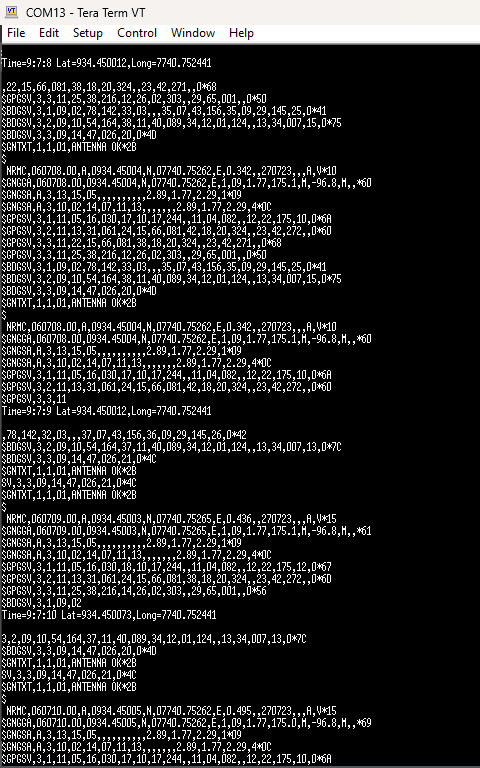
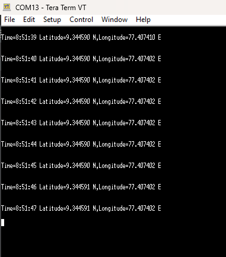

# Interfacing neo6m gps module with STM32
**Boards used:** B-L475E-IOT01A1<br>
**IDE:** STM32cubeIDE
### Pin configuration:
1. Connect 3v3 pin frm stm32 to vcc in neo6m.
2. Connect GND pin from stm32 to GND in neo6m.
3. Connect D0 pin from stm32 to TX pin in neo6m.
4. Connect D1 pin from stm32 to RX pin in neo6m.
5. Wait till the gps module get signals.<br> It will be indicated by red led blinking on gps module


### Instructions to follow in STM32cubeIDE:
1. I'm using UART4 to communicate with neo6m and USART1 to communicate with my laptop.
2. Enable both USART with asynchronous mode and set it to 9600 Baud rate.
3. Go to System Core in DMA go to DMA2 then add and select UART4_RX.
4. Save and generate code.

### Code Snippet:<br>
*Insert given code in appropriate user code spaces.*
```
/* USER CODE BEGIN Includes */
#include <stdio.h>
#include <string.h>
#include <stdlib.h>
/* USER CODE END Includes */

/* USER CODE BEGIN PV */
uint8_t Rxdata[750];
char Txdata[750];
char GPS_Payyload[100];
char check;
uint8_t Flag=0;
static int Msgindex;
char *ptr;

float time,Latitude,Longitude;
int Hours,Min,Sec;
/* USER CODE END PV */

/* USER CODE BEGIN 2 */

  HAL_UART_Receive_DMA(&huart4, (uint8_t*)Rxdata, 700);

  /* USER CODE END 2 */

  /* USER CODE BEGIN 3 */
	  get_location();
  }
  /* USER CODE END 3 */

/* USER CODE BEGIN 4 */
void HAL_UART_RxCpltCallback(UART_HandleTypeDef *huart)
{
	Flag=1;
}

void get_location(void)
{
    //this is for printing nmea code produced by gps module.
	//HAL_UART_Transmit(&huart1, (uint8_t*)Txdata, strlen(Txdata), HAL_MAX_DELAY);
	if(Flag==1)
	{
		Msgindex=0;
		strcpy(Txdata,(char*)(Rxdata));
		ptr=strstr(Txdata,"GNRMC");
		if(*ptr=='G')
		{
			while(1)
			{
				GPS_Payyload[Msgindex]=*ptr;
				Msgindex++;
				*ptr=*(ptr+Msgindex);
				if(*ptr=='\n')
				{
					GPS_Payyload[Msgindex]='\0';
					break;
				}
			}
			sscanf(GPS_Payyload,"GNRMC,%f,%c,%f,N,%f,",&time,&check,&Latitude,&Longitude);
			if(check == 'A')
			{
			Format_data(time,Latitude,Longitude);
			}
			else
			{
				HAL_UART_Transmit(&huart1, (uint8_t*)"invalid signals", 15, 100);
				HAL_UART_Transmit(&huart1, (uint8_t*)"\r\n", 2, HAL_MAX_DELAY);
			}
			HAL_Delay(1);
			Flag=0;
		}
	}
}

void Format_data(float Time,float Lat,float Long)
{
	char Data[100];
	Hours=(int)Time/10000;
	Min=(int)(Time-(Hours*10000))/100;
	Sec=(int)(Time-((Hours*10000)+(Min*100)));
	sprintf(Data,"\r\nTime=%d:%d:%d Latitude=%f N,Longitude=%f E",Hours,Min,Sec,Latitude/100,Longitude/100);
	HAL_UART_Transmit(&huart1, (uint8_t*)Data, strlen(Data), HAL_MAX_DELAY);
	HAL_UART_Transmit(&huart1, (uint8_t*)"\r\n\n", 3, HAL_MAX_DELAY);
}
/* USER CODE END 4 */
```
#### Use a Serial Terminal to view the output.
I use Tera Term to view my output.
- Run the code in STM32cubeIDE and open the serial terminal with 9600 baud rate and correct port.<br>

The output will be dk displayed in terminal.

Output with nmea string given by the module:<br>
</img>
<br><br>
Location with time, lattitude and longitude: <br>
 </img>

Output demonstration video can be found [here](./.Assets/demonstration.mp4).